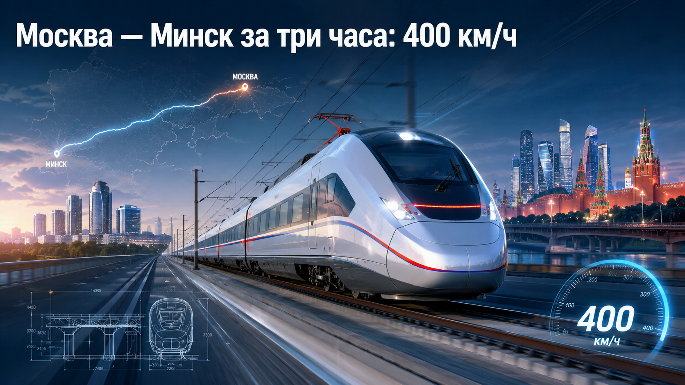
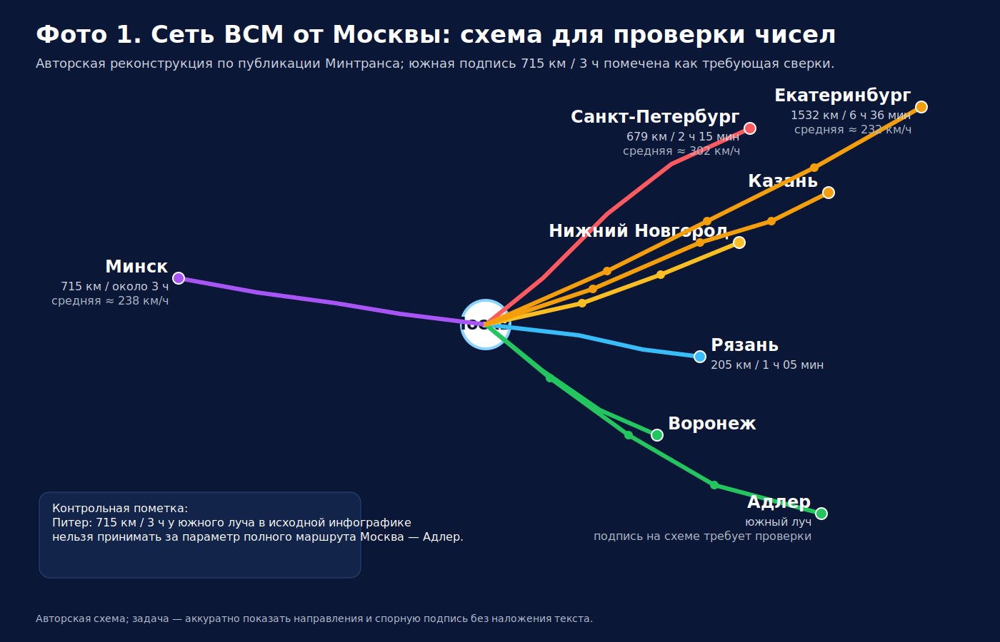
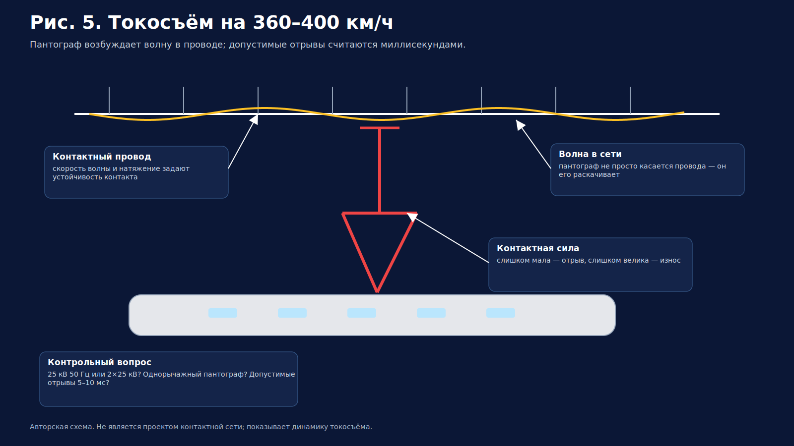
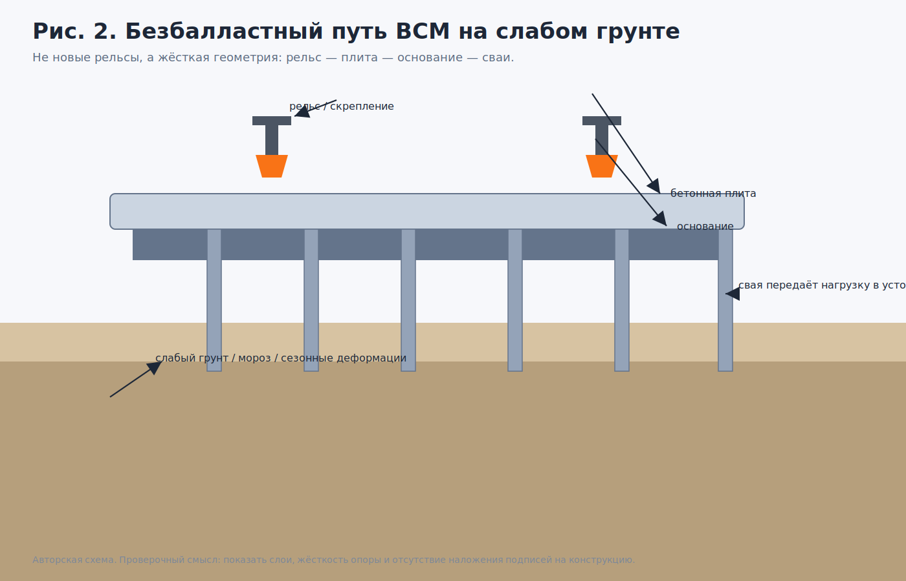
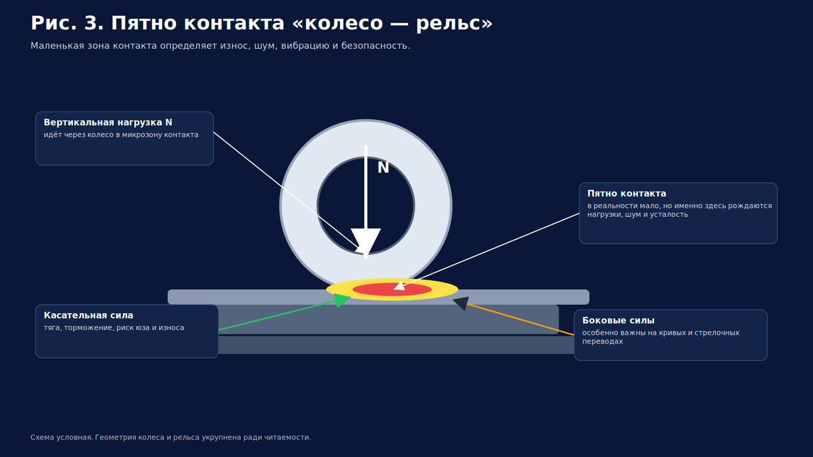
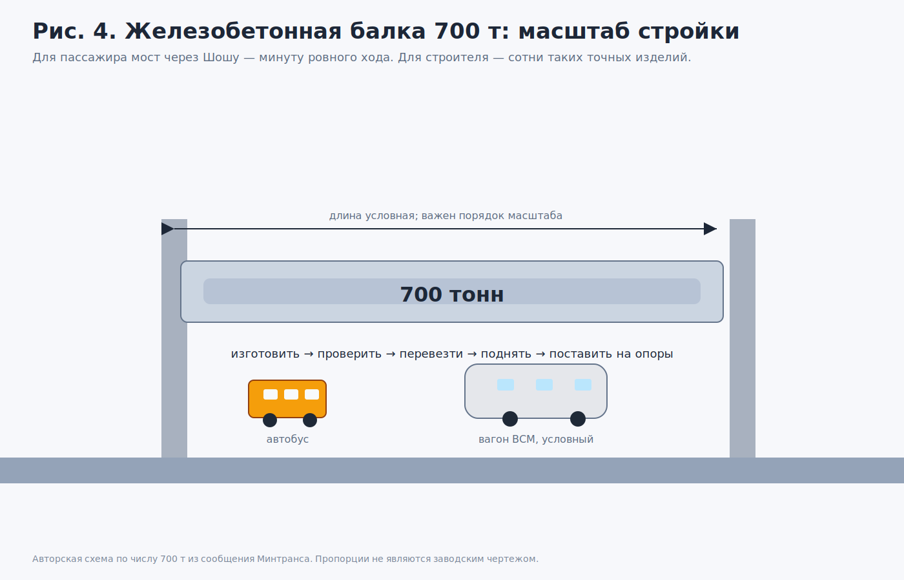
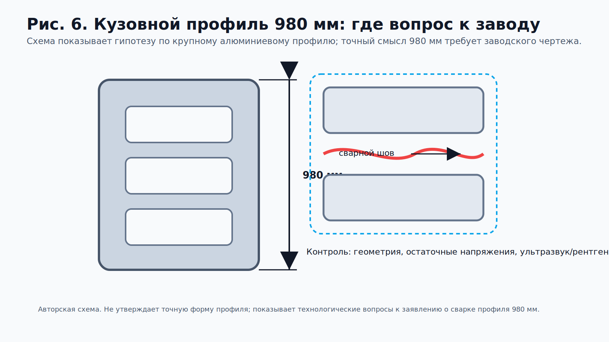
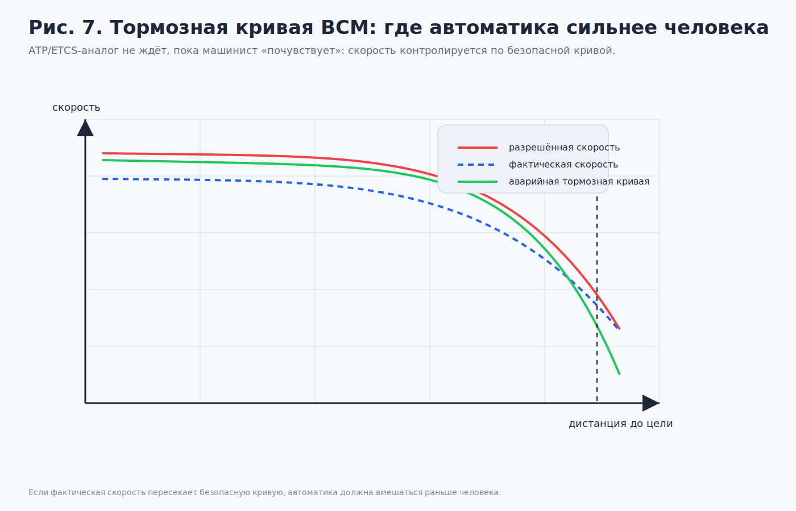
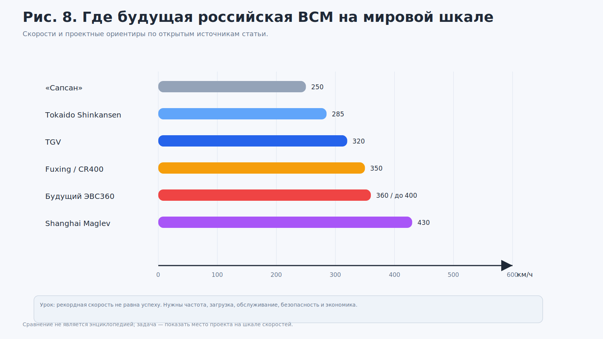

# Москва — Минск за три часа: холодный расчёт ВСМ на 400 км/ч

Министр транспорта Андрей Никитин попросил у Владимира Путина разрешения начать первый пакет расчётов по двум следующим высокоскоростным направлениям: Москва — Нижний Новгород — Казань и Москва — Минск. Президент ответил коротко: «Конечно» [1][2].

Для новостной ленты это одна реплика. Для инженера — список проверок: земля, мосты, токосъём, автоматика, деньги и скорость до 400 км/ч. Любая из этих строк способна сорвать срок.

На **Фото 1** показана схема будущей сети. Москва в центре. От неё расходятся цветные линии. Красная — к Санкт-Петербургу: 679 км и 2 часа 15 минут. Фиолетовая — к Минску: 715 км и около 3 часов. Голубая — к Рязани: 205 км и 1 час 5 минут. Восточная линия идёт через Нижний Новгород и Казань к Екатеринбургу: 1532 км и 6 часов 36 минут. Южный луч отмечен через Воронеж к Адлеру; на самой инфографике рядом с южным направлением видна подпись 715 км и 3 часа, но отраслевые материалы по полному направлению Москва — Адлер раньше давали другую пару чисел — около 1540 км и примерно 7 часов 50 минут [15]. Значит, картинку читаем не как утверждённый проект, а как рабочую схему, где одну подпись уже надо перепроверять.

**Фото 1. Инфографика сети высокоскоростных магистралей. Москва показана как узел, от которого расходятся направления к Санкт-Петербургу, Минску, Рязани, Нижнему Новгороду, Казани, Екатеринбургу и на юг.**

Начнём не с восторга. С арифметики.

## Что сказали официально
На встрече с президентом Никитин докладывал о строительстве ВСМ Москва — Санкт-Петербург и о следующих возможных направлениях. Среди российских маршрутов он поставил на первое место линию Москва — Нижний Новгород — Казань: по его словам, она даёт максимальный экономический смысл. Вторым по интересу министр назвал международный проект Москва — Минск [1].

Путин согласился начать расчёты. По Минску он добавил, что обсуждал проект с Александром Лукашенко и что белорусская сторона его поддерживает [1][2].

На этом месте полезно остановить фанфары. У минского направления пока нет утверждённой нитки маршрута, открытой сметы, тарифа и расписания. Есть переход в инженерную подготовку: теперь придётся считать землю, пассажиров, скорость, энергетику и риски.

Никитин сказал, что к 2028–2029 годам хорошо бы определиться с проектом и финансовой схемой [1]. На нормальном языке это значит: к этому времени должны появиться трасса, стоимость, источник денег и ответ на вопрос, как линия будет жить после открытия.

## Схема как таблица: что дают числа на карте
Инфографика хороша для обложки. Для «Техники — молодёжи» её надо разобрать как прибор.

| Направление | Длина в открытых материалах или на схеме | Заявленное время | Средняя скорость по поездке | Что настораживает |
|---|---:|---:|---:|---|
| Москва — Санкт-Петербург | 679 км | 2 ч 15 мин | около 302 км/ч | очень высокая средняя скорость даже для ВСМ |
| Москва — Минск | 715 км | около 3 ч | около 238 км/ч | без учёта возможных стоянок и контроля на границе |
| Москва — Рязань | 205 км | 1 ч 5 мин | около 189 км/ч | короткий маршрут сильнее теряет время на разгон и подходы |
| Москва — Екатеринбург | 1532 км | 6 ч 36 мин | около 232 км/ч | длинная линия потребует устойчивого графика и дорогой энергетики |
| Южный луч на схеме | подпись 715 км / 3 ч | не используем как проектный параметр | не считаем | вероятная неточность подписи на инфографике |
| Москва — Адлер по отраслевым публикациям о вариантах ВСМ | около 1540 км | около 7 ч 50 мин | около 197 км/ч | это уже не «короткий рывок», а магистраль на полстраны [15] |

К южному лучу нужна оговорка. Если принять подпись 715 км / 3 ч как Адлер, получится физически неверная картина: Москва — Адлер не может внезапно стать короче Москва — Минск. Поэтому южный луч оставляем как элемент схемы сети, а расчёт по Адлеру ведём по отдельным отраслевым публикациям.

Средняя скорость — ключ. Максимальные 400 км/ч не равны скорости всей поездки. Между Москвой и Петербургом при 679 км за 2 часа 15 минут средняя получается около 302 км/ч. Это уже уровень зрелой высокоскоростной системы, потому что в эти 135 минут входят разгон, торможение, подходы к городам и возможные остановки.

Для Москвы — Минска 715 км за 3 часа дают около 238 км/ч. Цифра спокойнее, но обманчиво спокойная. Если добавить стоянки, пограничные процедуры, снижение скорости на подходах к Москве и Минску, то на магистральной части поезд должен идти заметно быстрее средней. Иначе три часа рассыплются.

## Москва — Минск: почему это не обычная железнодорожная ветка
Внутренняя ВСМ трудна. Международная — труднее.

У маршрута Москва — Минск есть граница, два набора управленческих решений, два участка ответственности. Нужны совместимые правила безопасности, согласованный график, понятная тарифная логика, единые процедуры при сбое. Если поезд проходит больше ста метров в секунду, нельзя надеяться на «позвоним диспетчеру и разберёмся».

Административную поддержку сверху Путин обозначил [1][2]. Это снимает часть политического сопротивления. Но инженерная часть остаётся на месте: изыскания, землеотвод, тяговые подстанции, депо, связь, аварийные сценарии, персонал.

Самый неприятный вопрос не технический, а финансовый: кто платит, если пассажиров окажется меньше прогноза? Для проекта стоимостью триллионного класса это не мелочь, а начало расчёта.

## 400 км/ч в цифрах: что происходит с поездом
Никитин сказал: «400 километров в час — это практически другая физика» [1]. Фразу легко превратить в лозунг. Лучше превратим её в расчёт.

400 км/ч — это 111,1 м/с. За секунду поезд проходит больше длины футбольного поля. За три секунды — квартал небольшого города.

**Кинетическая энергия.**

На скорости 400 км/ч каждая тонна массы несёт:

$$
E = \frac{v^2}{2} \approx 6{,}17\ \text{МДж на тонну} \approx 1{,}7\ \text{кВт·ч на тонну}.
$$

Если взять восьмивагонный состав массой 500–600 т, его кинетическая энергия на 400 км/ч окажется примерно 0,85–1,03 МВт·ч. Это не абстрактная цифра: такой запас сравним с десятью крупными аккумуляторными блоками по 100 кВт·ч. Для тяговой системы это энергия, которую в одном цикле разгона и торможения надо принять, отдать, частично вернуть в сеть и не превратить в лишнее тепло. На 360 км/ч для того же диапазона масс получается около 0,69–0,83 МВт·ч.

Рекуперация часть этой энергии возвращает в сеть. Но «часть» — не волшебные 100 %. Вернуть энергию можно только если сеть способна её принять, если рядом есть потребители, если тяговые преобразователи и тепловой режим не упёрлись в предел. В удачном графике рекуперация даёт серьёзную экономию. В расчёте ВСМ её надо закладывать не рекламным процентом, а режимной картой: где поезд тормозит, кто в этот момент забирает энергию и что происходит, если потребителя рядом нет.

Отсюда простое следствие: тормоза ВСМ — это не «колодки посильнее». Это электрическое торможение, рекуперация, пневматика, дисковые тормоза, расчёт нагрева, защита от юза, резервные режимы. Один отказ не должен превращать поезд в летящий утюг.

**Аэродинамика.**

Сила сопротивления воздуха примерно растёт как квадрат скорости, а мощность на её преодоление — как куб скорости. Если сравнить 400 и 250 км/ч, аэродинамическая часть требуемой мощности увеличивается примерно в:

$$
\left(\frac{400}{250}\right)^3 \approx 4{,}1
$$

раза. Для 360 км/ч против 250 км/ч — почти в 3 раза.

Есть ещё один показатель, который редко попадает в ведомственные новости: число Маха. При 400 км/ч поезд идёт примерно на \(M \approx 0{,}33\). До сверхзвука далеко, но воздух уже нельзя считать безразличной средой. При встрече двух поездов, входе в тоннель или проходе мимо шумозащитных стен возникают волны давления. В открытом воздухе это обычно единицы сотен паскалей. В тоннелях и на встречных разъездах — уже величины порядка килопаскалей. Поэтому в руководствах по аэродинамике ВСМ отдельно разбирают pressure pulses, комфорт пассажиров, усталость кузова и воздействие на людей у линии [21].

Шум тоже становится инженерным ограничением, а не жалобой жителей после запуска. В международных материалах по нормированию шума ВСМ встречаются контрольные уровни порядка 75–85 дБА на расстоянии около 25 м от пути, в зависимости от страны, методики и показателя измерения [19]. Для 400 км/ч борьба идёт за каждую щель: нос, тележечные ниши, межвагонные переходы, пантограф, крышевое оборудование.

**Повороты.**

Боковое ускорение на кривой можно оценить так:

$$
a = \frac{v^2}{R}.
$$

На 400 км/ч при радиусе 7 км получится около 1,76 м/с² до учёта возвышения наружного рельса. При радиусе 20 км — около 0,62 м/с². Поэтому ВСМ требует длинных плавных кривых. Старую линию нельзя просто «подшаманить» и назвать высокоскоростной: её геометрию строили под другую механику.

## Контактная сеть: миллисекунды, в которых решается скорость

Обычная фраза «поезд питается от провода» на ВСМ звучит слишком грубо. Токосъём на 360–400 км/ч — отдельная динамическая задача.

Пантограф скользит по контактному проводу и одновременно возбуждает в нём волну. Если натяжение, масса провода, жёсткость подвески или предварительная стрела провеса выбраны плохо, контактная сила начинает прыгать. Появляются отрывы, искрение, перегрев вставки, износ провода. В европейских требованиях совместимость пантографа и контактной сети рассматривается отдельным стандартом EN 50367; современные обзоры по системе «пантограф — контактная сеть» прямо выделяют качество контакта как один из главных факторов устойчивой работы высокоскоростного поезда [9][10].

Конкретные параметры российской контактной сети для Москва — Минск пока не опубликованы. Для линий такого класса обычно рассматривают питание переменным током 25 кВ 50 Гц. На длинных участках часто применяют автотрансформаторную схему 2×25 кВ: поезд получает свои 25 кВ, а передача энергии по линии идёт с эффективным напряжением 50 кВ между контактным проводом и фидером, что снижает токи и потери [20]. Российское проектное решение надо ждать в открытом виде.

Счёт здесь идёт не только на километры и мегаватты, но и на миллисекунды. В техническом задании надо прямо указать допустимые отрывы контакта — для скоростей около 400 км/ч разумный масштаб вопроса уже 5–10 мс, а не «пару мгновений». Один такой отрыв сам по себе может пройти незаметно. Серия отрывов даёт искрение, нагрев, эрозию контактной вставки и быстрый износ провода.

Что хотелось бы увидеть в проектных материалах? Тип высокоскоростного однорычажного пантографа, диапазон контактной силы, параметры натяжения, частотную картину колебаний провода, работу при обледенении, систему диагностики провода и вставок. Плюс привязку к российскому регулированию: ТР ТС 001/2011 по подвижному составу, ТР ТС 002/2011 по высокоскоростному железнодорожному транспорту и ТР ТС 003/2011 по инфраструктуре [22]. Не общую фразу «будет надёжно», а графики: скорость — контактная сила — отрыв — износ.

## Путь: почему щебень уже не главный герой

Для первой ВСМ заявлен безбалластный путь: вместо щебёночной призмы — бетонные рельсовые плиты [3]. Это не мода.

Щебень удобен на обычной дороге: его подбили, выправили, снова пустили поезд. На 400 км/ч такая гибкость становится недостатком. Небольшая просадка создаёт динамический удар. Удар повторяется тысячами циклов. Потом вылезает вибрация, дефект, ограничение скорости.

Безбалластный путь дороже и строже к строителям. Ошибку не спрячешь подсыпкой. Зато он лучше держит геометрию и меньше зависит от сезонной выправки. Для России это особенно больная тема: мороз, оттепели, слабые грунты, болота. Никитин отдельно говорил о сложных грунтах в Московской, Тверской и Новгородской областях и о свайных основаниях [1].

Свая под ВСМ — не просто железобетонный столб. Она должна передать нагрузку в устойчивый слой так, чтобы путь не «дышал» под поездом. На скоростной линии дыхание грунта видно в расписании.

## Балка 700 тонн: тяжёлый масштаб первой линии

В докладе прозвучала деталь, которая сильнее любого лозунга: железобетонная балка весом 700 тонн. Первые две уже отлиты и проходят испытания; всего для таких изделий планируют задействовать 10 заводов [1].

700 тонн — это изделие, которое надо изготовить с точной геометрией, выдержать, проверить, довезти, поднять и поставить на опоры. Балка не прощает небрежности. Миллиметры на заводе становятся проблемой на трассе.

Один из крупнейших объектов ВСМ Москва — Санкт-Петербург — мост через Шошу длиной около 8 км [1]. Для пассажира это будет короткий ровный участок. Для строителей — сваи, опоры, температурные деформации, ветровые нагрузки, контроль осадки, стыки, вода и зима.

Красивый поезд появляется последним. До него должны появиться тысячи тяжёлых точных деталей.

## Поезд: что известно о машине для первой ВСМ

Поезд для линии Москва — Санкт-Петербург делают на «Уральских локомотивах». По открытым данным, базовый состав — 8 вагонов, вместимость около 454–460 пассажиров, несколько классов обслуживания, возможность сдваивать составы. Максимальная конструкционная скорость заявляется до 400 км/ч, эксплуатационная — до 360 км/ч [5][6].

Минтранс сообщал, что к 2028 году на первой линии должно быть 28 поездов, а к 2030 году — 43 состава. Поезд проектируется с распределённой тягой [3]. Это важно: тяговое оборудование размещается не в одном локомотиве, а распределяется по составу. Так легче разгоняться, тормозить, управлять сцеплением колёс с рельсом и сохранять устойчивость графика.

По промышленной кооперации тоже есть опорные числа. Никитин говорил примерно о 150 предприятиях, российских колесных парах и тяговом приводе, которые уже изготовлены, проходят испытания и готовятся к сертификации [1]. В материалах «Синары» для будущего поезда назывался отечественный тяговый привод мощностью 10 МВт, аэродинамический кузов и экструдированный алюминиевый профиль как основной материал кузова [7].

10 МВт — это мощность небольшого городского энергоузла на крыше и под полом поезда. Её надо не только получить из контактной сети, но и распределить по преобразователям, двигателям, системе охлаждения. На 360–400 км/ч тепловой режим становится скрытым ограничителем: перегрелся инвертор, деградировал датчик, не отвели тепло от тормозного резистора — и скорость превращается в строчку с ограничением.

## Профиль 980 мм: заводская фраза, которую нельзя проглатывать

Никитин сказал, что почти пять вагонов уже сварены и что впервые в мире выполнена сварка на профиле 980 мм [1].

Подробное технологическое описание в открытом сообщении не раскрыто. По косвенным данным из вагоностроения речь, скорее всего, идёт о крупногабаритном экструдированном алюминиевом профиле основного кузова — боковой стены, крыши или силовой секции, где размер порядка метра становится проблемой уже сам по себе. Но точный смысл «980 мм» без заводского чертежа, обозначения профиля и комментария технологов утверждать нельзя.

Почему это интересно? Алюминиевый кузов легче стального, но сварка крупного профиля — капризная операция. Металл ведёт от тепла. Возникают остаточные напряжения. Длинная деталь может уйти по геометрии, и потом дверь, окно или силовой узел окажутся не там, где их ждёт сборочный стапель.

Вопрос к заводу должен звучать не «правда ли, что это достижение?», а конкретнее: какой метод сварки применён, как контролируют шов, чем проверяют геометрию, сколько образцов разрушали на усталостных испытаниях, как держат допуски после охлаждения. Пока этих данных нет. Значит, фиксируем заявленный факт и не превращаем его в легенду раньше испытаний.

## Безопасность: машинист уже не главный датчик

На скорости 360–400 км/ч человек не может быть единственным контуром безопасности. Машинист остаётся в кабине, но система должна видеть дальше, считать быстрее и ошибаться реже человека.

Для линий такого класса нужны кабинная сигнализация, автоматический контроль скорости, расчёт тормозных кривых, непрерывная связь поезд — диспетчерский центр, резервирование каналов, контроль целостности состава и защита от выхода за разрешённый предел движения. В европейской логике ETCS поезд получает разрешение на движение и сам контролирует, не вышел ли он за безопасную границу; уровни и режимы ETCS описаны Европейской комиссией [8]. Это не значит, что российская ВСМ будет построена на ETCS. Это удобная мировая аналогия.

Для самой ответственной автоматики железных дорог обычно требуют уровень функциональной безопасности, сопоставимый с SIL4 в CENELEC-подходе. В непрерывном режиме для SIL4 речь идёт о вероятности опасного отказа функции безопасности порядка \(10^{-8}\)–\(10^{-9}\) в час [23]. Это не просто высокая надёжность, а доказанный жизненный цикл безопасности: анализ опасностей, независимая верификация, безопасное состояние при отказе, резервирование, протоколы испытаний, контроль изменений в программном обеспечении.

Что именно должно тянуть на такой уровень? Автоматическая защита поезда от превышения скорости, интервальное регулирование, вычисление тормозной кривой, команды экстренного торможения, контроль занятости пути, связь с диспетчерским центром и логика перехода в безопасное состояние при отказе. Тормозная система как железо и ATP как мозг должны быть связаны так, чтобы ошибка датчика или потеря радиоканала не оставляла поезд без защиты.

Вопросы к будущему проекту Москва — Минск прямые. Как резервируются каналы связи? Что делает поезд при потере радиоканала? Где граница между автоматическим ведением и контролем машиниста? Как система поведёт себя при пожаре, ложной занятости участка, отказе датчика, остановке на эстакаде зимой? Без ответов скорость 400 км/ч остаётся рекламной цифрой.

## Мировой масштаб: с кем сравниваемся
| Система | Коммерческий режим / проектная скорость | Масштаб и урок |
|---|---:|---|
| TGV, Франция | до 320 км/ч на линиях LGV | сильная школа пути и аэродинамики; успех зависит от загрузки линий и связки с обычной сетью [13] |
| Tokaido Shinkansen, Япония | до 285 км/ч | 372 рейса в сутки и 432 тыс. пассажиров в день в 2023 финансовом году [11] |
| Fuxing / CR400, Китай | коммерческая эксплуатация до 350 км/ч на отдельных линиях | серийность и огромная сеть стала не менее важна, чем скорость [16] |
| Российский поезд для первой ВСМ | эксплуатационная до 360 км/ч, максимум до 400 км/ч | заявка выше типового европейского режима, но впереди испытания и сертификация |
| Shanghai Maglev | до 430 км/ч на короткой коммерческой линии | уже не колесо — рельс, а отдельная инфраструктура [17] |
| SCMaglev / Chuo Shinkansen, Япония | проектный режим около 500–505 км/ч | футуризм с дорогими тоннелями, долгими сроками и отдельной технологией [18] |

Особенно полезно сравнение с Tokaido Shinkansen. Для ВСМ Москва — Санкт-Петербург называли пассажиропоток не менее 23 млн человек в год [4]. Это примерно 63 тыс. пассажиров в день. У Tokaido Shinkansen — 432 тыс. в день [11]. Разница примерно в семь раз.

Это не повод смеяться над российским проектом. Это повод трезво оценивать экономику. Японская линия — транспортный конвейер. Российская первая ВСМ, даже при хорошем спросе, будет жить в другой плотности пассажиропотока. Значит, цена билета, государственная поддержка, стоимость обслуживания и график должны считаться без самообмана.

Европейский опыт тоже не весь блестит лаком. Европейская счётная палата в 2018 году назвала сеть ВСМ ЕС «не реальностью, а неэффективным лоскутным одеялом» и критиковала задержки, удорожания и слабую координацию проектов [12]. Для России это полезный урок: построить быструю линию мало. Надо, чтобы она работала как часть сети, а не как дорогой остров.

## Почему у нас до сих пор не было сети ВСМ

Россия имеет огромную железную дорогу. Но огромная сеть и высокоскоростная сеть — разные вещи.

Историческая линия Москва — Санкт-Петербург идёт по удачному прямому направлению ещё с XIX века, но она смешанная: пассажирские, пригородные, скорые и грузовые поезда делят инфраструктуру. Для ВСМ это плохо. Медленный грузовой состав и поезд на 360 км/ч требуют разных графиков, разных допусков и разной философии пути.

Попытки были. В СССР создали ЭР200 и ЧС200, рассчитанные на 200 км/ч. В 1980-х проектировали выделенные ВСМ Москва — Ленинград и Москва — Юг. В 1991 году появился указ о магистрали Санкт-Петербург — Москва, в 1992 году — РАО «ВСМ». Потом проект упёрся в деньги и организацию [14].

Был и ЭС-250 «Сокол». Его хотели сделать отечественным высокоскоростным поездом, но испытания 2000–2002 годов выявили проблемы, которые не позволили выйти на безопасную пассажирскую эксплуатацию в задуманном виде [14].

Поэтому нынешний проект интересен не картой. Карты рисовали и раньше. Отличие нынешнего цикла в том, что одновременно строят инженерные сооружения, готовят заводскую кооперацию, варят первые кузова, обсуждают серийные поезда и уже примеряют следующие направления.

## «Сапсан»: быстрый поезд, но не сеть ВСМ

«Сапсан» приучил пассажиров к мысли, что поезд между Москвой и Петербургом может быть быстрым. Но это не выделенная сеть ВСМ. Это скоростной поезд на модернизированной линии, где рядом живёт другая железнодорожная работа.

Новая ВСМ должна отличаться не только составом. Её смысл — отдельная трасса, безбалластный путь, собственная энергетика, другая автоматика, другой график. Если в час пик обещают интервал до 15 минут [3], то речь идёт не о нескольких быстрых рейсах, а о почти конвейерном режиме.

Японцы показывают, что успех высокоскоростной линии измеряется не рекордной цифрой на спидометре, а повторяемостью: рейс за рейсом, день за днём, с минимальным разбросом графика. Российской ВСМ придётся доказать именно это.

## Риски: где схема может провалиться
**Цена километра.**

Для ВСМ Москва — Санкт-Петербург в открытых публикациях фигурирует стоимость 2,349 трлн рублей при длине 679 км [4]. Грубое деление даёт около 3,46 млрд рублей за километр. Это средняя температура по больнице: в ней смешаны земля, станции, мосты, подходы, связь, энергетика, депо, выкуп участков, проектирование и работы, которые распределены по трассе очень неравномерно.

Для Москвы — Минска открытой сметы пока нет. Но арифметика уже предупреждает: полноценная ВСМ в российских условиях — разговор не о «нескольких десятках миллиардов».

**Окупаемость.**

Пассажиропоток надо считать сценариями. Сколько людей уйдёт с самолёта? Сколько пересядет с обычных поездов? Сколько поездок появится заново? Что будет при дорогом кредите, росте стройматериалов, удорожании электроники, задержке ввода? Европейская счётная палата в своём отчёте по ВСМ прямо указывала на проблемы стоимости, задержек и слабой координации: не всякая линия с высокой скоростью автоматически становится эффективной [12].

Для Петербургской ВСМ опорная цифра спроса есть — не менее 23 млн пассажиров в год [4]. Для Минска публичной сопоставимой цифры пока нет.

**Земля и экология.**

Прямая линия на карте проходит не по пустому листу. Там деревни, леса, водоохранные зоны, сельхозземли, старые коммуникации. Чем выше скорость, тем меньше свободы обойти конфликтное место крутым поворотом. ВСМ любит прямоту, а реальная земля любит спорить.

**Локализация.**

Российские колесные пары и тяговый привод заявлены [1]. Это сильная позиция. Но глубокая локализация — это ещё силовая электроника, датчики, программное обеспечение, материалы, станки, испытательные стенды, диагностические комплексы. «Собираем здесь» и «воспроизводим технологическую цепочку» — разные уровни независимости.

**Климат и тепло.**

Для России вопрос не экзотический, а ежедневный: мокрый снег на контактной сети, лёд на элементах подвески, морозные деформации, резкие переходы через ноль, снежная пыль в подвагонном оборудовании. Скорость 360 км/ч не любит сюрпризы. Летом другой враг — тепло: тяговые инверторы, трансформаторы, тормозные резисторы, аккумуляторные цепи, кондиционирование салона и охлаждение силовой электроники. На бумаге всё это выглядит отдельными системами. В жаркий день после серии торможений они превращаются в общий тепловой баланс поезда.

**Кадры.**

Минтранс упоминал подготовку кадров для ВСМ [1]. И правильно. Но нужны не только машинисты. Нужны сварщики алюминиевых профилей, специалисты по безбалластному пути, инженеры контактной сети, дефектоскописты, мостовики, акустики, программисты систем управления движением, эксплуатационники депо. Такая дорога держится не героизмом, а регламентом.

## Что именно надо решить по Москве — Минску

По минскому направлению открытых технических данных пока мало. Поэтому не будем делать вид, что они есть. Но список будущих вопросов уже можно составить.

Трасса. Чем прямее линия, тем выше скорость и тем тяжелее землеотвод.

Подходы к городам. На магистральном участке можно проектировать 360 км/ч, а у Москвы и Минска скорость съедят развязки, плотная застройка, станции и требования безопасности.

Остановки. Каждая остановка забирает минуты: торможение, посадка, высадка, разгон. Если линия должна обслуживать промежуточные города, придётся выбирать между доступностью и временем в пути.

Граница. Если контроль пассажиров будет устроен по тяжёлой аэропортовой логике, три часа на рельсах легко превратятся в четыре-пять часов полной поездки. Процедура должна быть такой же быстрой, как поезд.

Единая эксплуатация. Международная линия требует общей дисциплины. На бумаге можно согласовать почти всё. В реальности поезд на 111 м/с проверит каждую слабую строку инструкции.

## Состав графики в архиве
Одной карты мало. В этот GitHub-пакет уже добавлен полный набор авторских схем; таблица ниже служит навигацией по рисункам.

| Рисунок | Подпись | Что объясняет |
|---|---|---|
| Рис. 2 | Поперечник безбалластного пути: рельс, плита, основание, сваи на слабом грунте | почему ВСМ нельзя свести к новым рельсам |
| Рис. 3 | Пятно контакта «колесо — рельс» при высокой скорости | откуда берутся боковые силы, износ и вибрации |
| Рис. 4 | Балка 700 тонн рядом с автобусом или вагоном | физический масштаб стройки |
| Рис. 5 | Пантограф и контактная сеть: волна в проводе, контактная сила, зона отрыва | почему токосъём решается в миллисекундах |
| Рис. 6 | Кузовной профиль 980 мм: алюминиевый профиль, шов, контроль геометрии | что скрывается за короткой заводской фразой |
| Рис. 7 | Тормозная кривая ВСМ: разрешённая скорость, фактическая скорость, точка безопасной остановки | как автоматика не даёт поезду выйти за предел движения |
| Рис. 8 | Сравнение: «Сапсан», TGV, Shinkansen, будущий ЭВС360 | где российский проект находится на мировой шкале |

Такая графика нужна не для красоты. Она переводит слово «ВСМ» из презентации в предмет, который можно мысленно потрогать.

## Маглев: почему не прыгнуть сразу к 500 км/ч

При разговоре о 400 км/ч неизбежно всплывает магнитная левитация. Логика понятна: если колесо и рельс так капризны, может быть, убрать контакт вообще?

Технически маглев красив. Shanghai Maglev развивает до 430 км/ч на короткой коммерческой линии [17]. Японский SCMaglev для Chuo Shinkansen проектируется примерно на 500–505 км/ч; JR Central указывает рекорд 603 км/ч для пилотируемого рельсового транспортного средства [18].

Но маглев требует отдельной инфраструктуры. Его нельзя пустить по обычной железной дороге, нельзя встроить в существующую сеть простым переходником, нельзя дёшево масштабировать через старые станции. Для страны, где ещё нет ни одной полноценной коммерческой колесно-рельсовой ВСМ, попытка сразу перескочить к маглеву может закончиться вечным опытным полигоном.

Колесная ВСМ на 360 км/ч в эксплуатации выглядит земнее. Дорого. Рискованно. Но ближе к промышленному тиражированию.

## Что должно появиться к 2028–2029 годам

По Москва — Минск к 2028–2029 годам нужен не буклет, а инженерный пакет.

В нём должны быть трасса с обоснованием, расчёт спроса, список остановок, схема прохождения границы, оценка стоимости, финансовая конструкция, распределение рисков между Россией и Беларусью, требования к поезду, принцип управления движением, схема электроснабжения, экологические ограничения, этапы строительства.

Без этого проект останется линией на тёмной карте. С этим — станет объектом, который уже можно ругать и защищать по делу.

## Сухой остаток
Москва — Минск за три часа звучит эффектно. Но проверять надо не эффектность, а систему.

Сможем ли держать геометрию пути на слабых грунтах? Сможем ли варить крупный алюминиевый кузов серийно, а не для одного образца? Сможем ли обеспечить токосъём на 360–400 км/ч в мокрый снег? Сможет ли автоматика безопасно остановить поезд, когда человек уже опоздал бы с реакцией? Сойдётся ли экономика при реальном пассажиропотоке, а не при идеальном?

Сейчас по Москва — Минск есть политическое согласие и разрешение начать расчёты. По первой линии Москва — Санкт-Петербург уже строят инженерные сооружения и собирают первые вагоны. Между этими двумя состояниями — вся дистанция от схемы до работающей техники.

Главный вопрос не в том, сможет ли поезд один раз показать красивую скорость.  
Главный вопрос жёстче: сможет ли вся система день за днём проходить свои 111 метров в секунду без права на небрежность.

## Источники и комментарии к ним

[1] Минтранс России. «Владимир Путин провел встречу с Министром транспорта Андреем Никитиным», 15 июня 2026. Главный источник по встрече, предварительным расчётам Москва — Минск, пяти вагонам, профилю 980 мм, 150 предприятиям, мосту через Шошу, балке 700 тонн и сложным грунтам.  
https://mintrans.gov.ru/press-center/news/12756

[2] Президент России. «Встреча с Министром транспорта Андреем Никитиным», 15 июня 2026. Официальная стенограмма Кремля с репликами по Москва — Минск и поддержке со стороны Беларуси.  
https://kremlin.ru/events/president/news/80035

[3] Минтранс России. «Поезда на ВСМ будут ходить в час-пик каждые 15 минут», 19 ноября 2025. Данные о 28 поездах к 2028 году, 43 поездах к 2030 году, распределённой тяге, заводских испытаниях и безбалластном пути.  
https://mintrans.gov.ru/press-center/news/12286

[4] РБК Санкт-Петербург. «В проект ВСМ Москва—Петербург внесли новый тип инфраструктуры», 26 марта 2026. Актуальная для 2026 года публикация с параметрами 679 км, 2 часа 15 минут, 16 остановок и стоимостью 2,349 трлн рублей.  
https://www.rbc.ru/spb_sz/26/03/2026/69c4e85c9a79474af29f6e74

[5] РБК Екатеринбург. «Уральские локомотивы» получат ₽12 млрд за первые поезда для ВСМ, 15 апреля 2024. Контракт на первые два состава, восьмивагонная компоновка, скорости 400/360 км/ч. Источник старый, но относится к конкретному контракту, поэтому оставлен как историческая опорная точка.  
https://ekb.rbc.ru/ekb/freenews/661d28319a794780af4ea7da

[6] «Коммерсантъ». «Первый российский поезд для ВСМ Москва—Санкт-Петербург получил название “Белый кречет”», 28 ноября 2024. Открытые параметры будущего поезда: 8 вагонов, 454 места, классы обслуживания.  
https://www.kommersant.ru/doc/7311261

[7] «Синара-Девелопмент». «ВСМ как драйвер промышленного строительства», 30 июня 2025. Данные о тяговом приводе 10 МВт, аэродинамике и экструдированном алюминиевом профиле кузова.  
https://sinara-development.ru/media/media-about-us/vsm-kak-drayver-promyshlennogo-stroitelstva/

[8] European Commission. «ETCS Levels and Modes». Использовано как мировая аналогия по автоматическому контролю движения, режимам Full Supervision и Automatic Driving; это не утверждение, что российская ВСМ будет построена на ETCS.  
https://transport.ec.europa.eu/transport-modes/rail/ertms/what-ertms-and-how-does-it-work/etcs-levels-and-modes_en

[9] EN 50367:2020/A2:2025. Railway applications — technical compatibility between pantographs and overhead contact lines. Использовано как справка о том, что взаимодействие пантографа и контактной сети регулируется отдельными требованиями совместимости.  
https://standards.iteh.ai/catalog/standards/clc/9a336810-3e68-4766-9e95-0da50f04e0a0/en-50367-2020-a2-2025

[10] Wu G. et al. «Pantograph–catenary electrical contact system of high-speed railways: recent progress, challenges, and outlooks», 2022. Обзор по динамике взаимодействия пантографа и контактной сети.  
https://link.springer.com/article/10.1007/s40534-022-00281-2

[11] JR Central. «About the Shinkansen». Официальные данные о Tokaido Shinkansen: 285 км/ч, 372 рейса в день и 432 тыс. пассажиров в день в 2023 финансовом году.  
https://global.jr-central.co.jp/en/company/about_shinkansen/

[12] European Court of Auditors. «A European high-speed rail network: not a reality but an ineffective patchwork», Special report 19/2018. Использовано для блока о рисках, стоимости, задержках и слабой координации проектов ВСМ.  
https://op.europa.eu/webpub/eca/special-reports/high-speed-rail-19-2018/en/

[13] SNCF Connect. «TGV: Train Grande Vitesse». Справочная информация о коммерческих скоростях TGV до 320 км/ч на линиях LGV.  
https://www.sncf-connect.com/en-en/tgv

[14] ТАСС. «История проектов высокоскоростных железнодорожных магистралей в России», 17 августа 2023. Исторический контекст: ЭР200, проекты 1980-х, РАО «ВСМ», ЭС-250 «Сокол».  
https://tass.ru/info/18531365

[15] TR.ru — Транспорт в России. «Для ВСМ и не только: подписаны документы о новых поездах и высокоскоростной инфраструктуре», 7 июня 2024. Использовано для сопоставления перспективных направлений сети, включая южный маршрут.  
https://tr.ru/news/5577-dlya-vsm-i-ne-tolko-podpisany-dokumenty-o-novyh-poezdah-i-vysokoskorostnoy-infrastrukture

[16] CRRC. «Fuxing bullet trains to restore 350 km/h speed», 31 июля 2017. Справка по китайскому режиму 350 км/ч на линии Beijing — Shanghai.  
https://www.crrcgc.cc/en/2017-07/31/article_A4DE7A8394684916A536DDBBF3E5BCEC.html

[17] Shanghai Maglev Transportation Development Co. Официальная справка по Shanghai Maglev: коммерческая скорость до 430 км/ч.  
https://www.smtdc.com/en/jykf.html

[18] JR Central. Annual Report 2024, раздел Superconducting Maglev / Chuo Shinkansen. Проектная скорость 505 км/ч и рекорд 603 км/ч.  
https://global.jr-central.co.jp/en/company/ir/annualreport/_pdf/annualreport2024-12.pdf

[19] Federal Railroad Administration. «High Speed Rail Noise Standards and Regulations», 2021. Использовано для справки о шумовых нормативах ВСМ и контрольных расстояниях измерения шума.  
https://railroads.dot.gov/sites/fra.dot.gov/files/2021-02/HSR%20Noise%20Standards%20and%20Regulations.pdf

[20] California High-Speed Rail Authority. «Traction Power 2×25 kV Autotransformer Electrification System». Техническая справка о схемах 1×25 кВ и 2×25 кВ для высокоскоростных линий.  
https://hsr.ca.gov/wp-content/uploads/docs/programs/eir_memos/Proj_Guidelines_TM3_1_1_1R02.pdf

[21] Federal Railroad Administration / Arup. «Design Considerations for High-Speed Rail: Aerodynamics», 2022. Использовано для блока о волнах давления, тоннельных эффектах и аэродинамических воздействиях ВСМ.  
https://railroads.dot.gov/sites/fra.dot.gov/files/2022-07/Arup%20Aero-A.pdf

[22] Евразийская экономическая комиссия. ТР ТС 001/2011, ТР ТС 002/2011, ТР ТС 003/2011. Технические регламенты по безопасности железнодорожного подвижного состава, высокоскоростного железнодорожного транспорта и инфраструктуры.  
https://eec.eaeunion.org/comission/department/deptexreg/tr/bezopJPS.php

[23] IEC 61508 / CENELEC EN 50126, EN 50128, EN 50129. Стандарты функциональной безопасности и железнодорожной автоматики; использованы для пояснения смысла SIL4 и требований к жизненному циклу безопасности.  
https://www.intertechrail.com/understanding-sil-in-railway-systems
